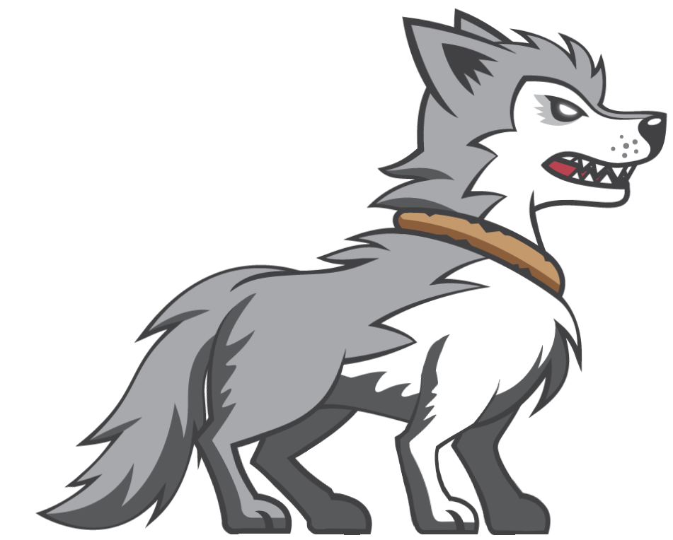
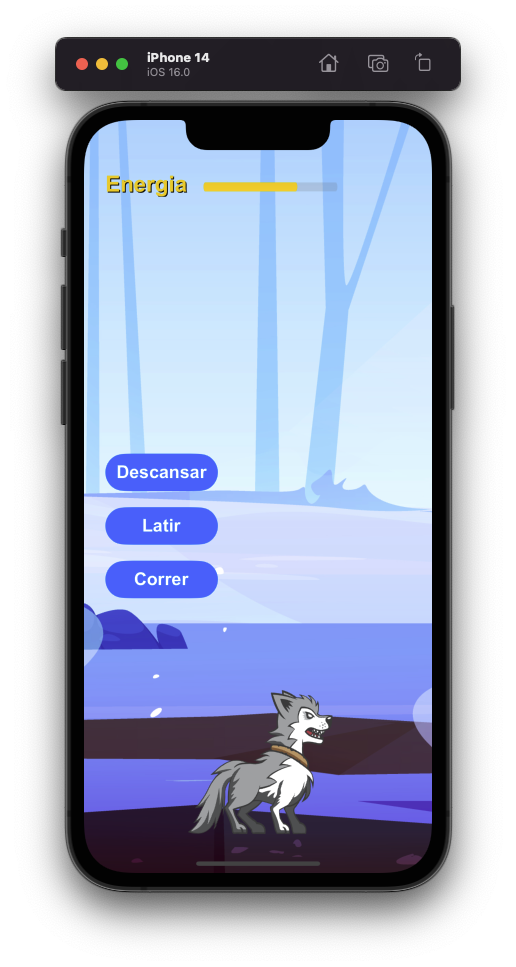

#  Desafio Tamogotigo

---

## Resumo geral

Oie, eu sou o Snow 🐶

No desafio de hoje você terá que implementar meu app, e eu que vou te guiar como deve ser feito.

Ele tem a seguinte aparência:

No meu app eu posso:

- Correr
- Latir
- Descansar

Quando eu corro gasto 25 de energia, quando eu lato gasto 10 e quando eu descanso recupero 15 de energia.

Se por algum motivo minha energia chegar a 0 ou menos, infelizmente desse mundo não farei mais parte. Por isso cuidado para não me levar a exaustão.

## Informações

A UI já está criada, porém sinta-se a vontade para modificá-la caso quiser.

Nela já temos os 3 botões de ação, porém eles não fazem nada, nem link possuem.

A barra de energia também já está inclusa, sendo uma `Progress Bar`. Assim como os botões ela está sem qualquer ação.

Dentro da `ViewController` tem os métodos para as minhas ações, esses métodos devem ser modificados, porém sem remover a implementação existente, pois ela é a responsável por efetuar minhas animações. E eu gosto de ser animado! 

Tente utilizar o máximo de conceitos que vimos até hoje.

Woof!

## Regras do Jogo

- Ao escolher descansar deve aumentar a energia em 15
- Ao escolher correr deve diminuir a energia em 25
- Ao escolher latir deve diminuir a energia em 10
- Se a energia chegar a 0 devo ser derrotado e uma mensagem de Game Over deve ser exibida
- A energia não pode exceder o máximo de 100

### Bônus Points

- Ao escolher qualquer botão de ação este deve ficar desativado por 3s, após permitir que seja pressionado novamente. Leia o código e verá que já tem boa parte do caminho desenvolvida para conseguir fazer isso

## Extras

Além de sentar, correr e ser derrotado, também tenho animações para:

- Atacar
- Ser atordoado
- Levar um ataque
- Pular
- Rolar
- Caminhar

Se quiser exercitar sua criatividade e implementar ações para alguma dessas minhas interações, entre em contato com a minha mestra Julia e ela lhe enviará as animações. Woof!
